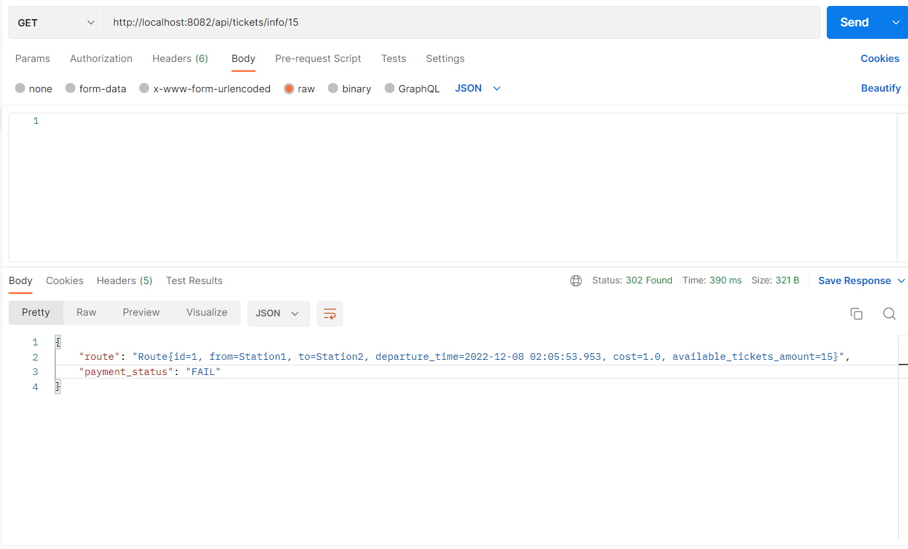
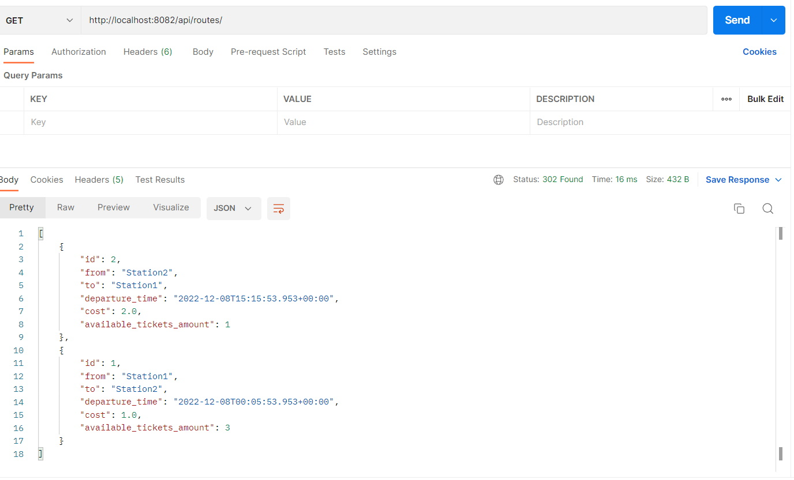
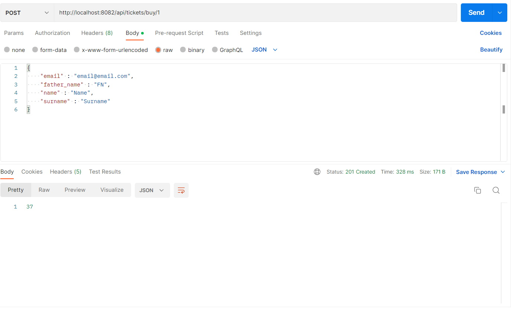
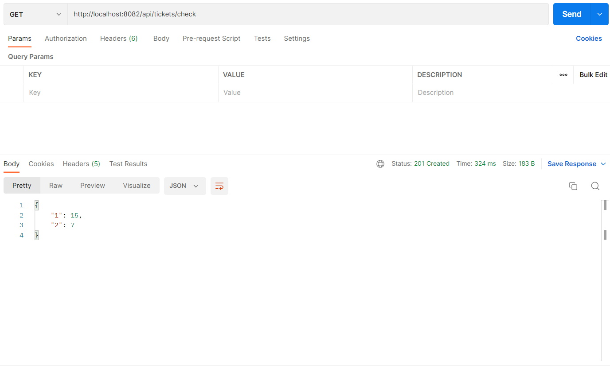

<h1 align="center">BUS TICKETS TRADE SYSTEM</h1>
<h4 align="center">Spring boot REST API that contains 2 microservices (Payment system and Ticket management) and provides endpoints to buy bus tickets</h4>

 <!--spacing 20px-->

<h2>Contents</h2>
<ul>
    <li>
        <a href="#overview">Overview</a>
    </li>
    <li>
        <a href="#technologies-stack">Technologies stack</a>
    </li>
    <li>
        <a href="#endpoints-description">Endpoints description</a>
    </li>
    <li>
        <a href="#postman">Postman</a>
    </li>
</ul>

 <!--spacing 20px-->

<h2 id="overview">Overview</h2>

There are 2 microservices in this Spring Boot Rest API that allows to manage payments and 
tickets separately and using 2 separate databases. 
The application allows buy ticket (new Ticket will be created as well as a new Payment for this ticket), 
set random status for payments (imitation of payments dynamic processing), 
get information about Routes, Tickets and Payments.

 <!--spacing 20px-->

<h2 id="technologies-stack">Technologies stack</h2>
<ul>
    <li>
        
Spring Boot

    </li>
    <li>
        
Maven

    </li>
    <li>
        
JUnit and Mockito

    </li>
    <li>
        
PostgreSQL database

    </li>
</ul>

 <!--spacing 20px-->

<h2 id="endpoints-description">Endpoints description</h2>
<ul>
    <li>
        
GET <b>http://localhost:8082/api/routes/</b>

        

            Tickets system endpoint that allows to receive full information about all the Route 
            entities from database as a List of objects with fields: (id, from, to, departure_time, cost, available_tickets_amount)
        

    </li>

 <!--spacing 10px-->
    <li>
        
POST <b>http://localhost:8082/api/tickets/buy/{route_id}</b>

        

            Takes ClientDTO object as a RequestBody parameter and id of Route as a PathVariable. 
            Provides the process of Ticket purchase. Receives data from database about Client, 
            receives data from database about Route and sends HTTP request to Payment system to create
            a new Payment object, receiving its' id. 
            Creates Ticket object in database filling all the data according to the received before
            Route, Payment and Client. Updates information of the Route object in database (available tickets amount and 
            bought tickets list). Returns id of the created Ticket. 
        

    </li>

 <!--spacing 10px-->
    <li>
        
GET <b>http://localhost:8082/api/tickets/check</b>

        

            Checks status of payment of each Ticket and finds ones with "NEW" status. Filters them according to the 
            status, time of the last check, deleted boolean and checked boolean. Sets new statuses for payments of 
            filtered tickets randomly ("NEW". "DONE, "FAIL"). Saves all the changes in database. 
            In case of any ticket receives status "FAIL", it receives checked marker and the id of the route as a key 
            and amount of available tickets as a value will be added to the created map. Returns created map of routes 
            ids and theirs available tickets amounts. 
            In case of any ticket receives status "DONE", it receives checked marker, but route information will not be added
            into the map. 
            Receiving status "NEW" will not provide any changes and returns. 
        

    </li>

 <!--spacing 10px-->
    <li>
        
PUT <b>http://localhost:8082/api/tickets/info/{ticket_id}</b>

        

            Returns Ticket information as a TicketInfo DTO by id received in parameter.
        

    </li>

 <!--spacing 10px-->
    <li>
        
GET <b>http://localhost:8083/api/pay/status/{id}</b>

        

            Receives id of a Payment and changes the status (in the current variant, this is a random status). Returns a new set status.
        

    </li>

 <!--spacing 10px-->
    <li>
        
GET <b>http://localhost:8083/api/pay/st/{id}</b>

        

            Receives id of a Payment and returns its status value. 
        

    </li>

 <!--spacing 10px-->
    <li>
        
PUT <b>http://localhost:8083/api/pay/statuses</b>

        

            Sets statuses for all Payment entities from database (in this variant, statuses are randomly chosen). 
            Returns map of id of payment as a key and new status of payment as a value.
        

    </li>

 <!--spacing 10px-->
    <li>
        
PUT <b>http://localhost:8083/api/pay/statuses</b>

        

            Sets statuses for all Payment entities from database (in this variant, statuses are randomly chosen). 
            Returns map of id of payment as a key and new status of payment as a value.
        

    </li>

 <!--spacing 10px-->
    <li>
        
POST <b>http://localhost:8083/api/pay/{amount}</b>

        

            Receives amount and ClientDTO and creates new Payment with these details. 
            Finds Client entity in database according to the ClientDTO email. 
            Saves payment in database according to received amount and Client information 
            from found in database before entity. Returns Payment's id.
        

    </li>
</ul>

 <!--spacing 20px-->

<h2 id="postman">Postman</h2>

Use Postman to try HTTP requests after the application run. 

The images below shows examples variants of endpoints requests and responses

 <!--spacing 20px-->